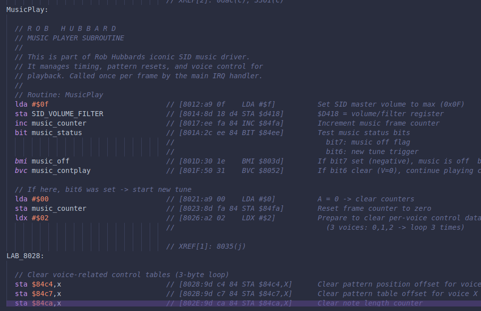

# Kick Assembler Export Script for Ghidra

[](https://github.com/yourusername/ghidra-kickass-export/releases) [](https://opensource.org/licenses/MIT) [](https://ghidra-sre.org/)

Export Ghidra disassembly to Kick Assembler format with comprehensive symbol handling and cross-references. This Python script is designed for reverse engineering and decompilation of retro 6502/6510/65C02 programs, converting analyzed binaries into clean, reassemblable source code that preserves your research and analysis work.

Useful for reverse engineering classic games, firmware analysis, and retro software projects on systems like the Commodore 64, Apple II, NES, Atari 8-bit, and other 6502-based platforms. The tool preserves your Ghidra analysis—including user-defined labels, comments, function boundaries, data structures, and memory maps—while generating proper Kick Assembler syntax with optimized addressing modes and symbol resolution.

The script creates two files: a main assembly file with your program's disassembled code and data, plus a separate symbols file containing labels with cross-reference information. This approach helps organize the output and makes it easier to understand program flow, identify code patterns, and track data usage across the software.

Intended for retro computing enthusiasts, ROM hackers, game preservation projects, and anyone analyzing classic software. Whether you're documenting source code, creating educational materials, analyzing copy protection, or preparing code for modification, this tool converts binary analysis into workable assembly source code.

## Screenshots

### Sample Output Comparison

| Ghidra Disassembly                                 | Kick Assembler Output                                        |
| -------------------------------------------------- | ------------------------------------------------------------ |
|  |  |

## Features

- ✅ Converts Ghidra disassembly to Kick Assembler syntax
- ✅ Preserves symbols and labels with proper sanitisation
- ✅ Generates separate symbols file with cross-references
- ✅ Handles various 65xx addressing modes
- ✅ Maintains comments and cross-reference information
- ✅ Unified processing of code and data sections
- ✅ Configurable output paths with persistence
- ✅ PETSCII comment generation for data bytes

## Installation

1. **Download the script**: Copy `KickAssemblerExport.py` to your Ghidra scripts directory:
   - **Windows**: `%USERPROFILE%\ghidra_scripts`
   - **Linux/macOS**: `~/ghidra_scripts`
2. **Refresh Ghidra**: In Ghidra's Script Manager (Window → Script Manager → Refresh button)


## Usage

### GUI Mode

1. Open your program in Ghidra
2. Run the script via:
   - **Script Manager**: Find "Kick Assembler Export" under "Kick Assembler Tools"
   - **Keyboard**: `Ctrl+Alt+K`
   - **Menu**: Tools → Kick Assembler Export

### Output Files

- `[ProgramName].asm` - Main assembly file with code and data
- `[ProgramName]_Symbols.asm` - Symbols and labels file with cross-references

### Sample Output

**Main Assembly File:**

```assembly
// Disassembly of: C64_Game
// Generated on: 2024-01-15 14:30:22
// Exported from Ghidra to Kick Assembler format

#import "C64_Game_Symbols.asm"

// *** BLOCK START: RAM (0800 - 0FFF) ***
.pc = $0800 "RAM"

start:
  lda #$00                           // [0800:A9 00     LDA #0x0]
  sta BORDER_COLOR                   // [0802:8D 20 D0  STA $d020]
  jmp main_loop                      // [0805:4C 10 08  JMP $0810]
```

**Symbols File:**

```assembly
#importonce

.label BORDER_COLOR = $D020        // XREF[3]: start:0802(W), init:0820(W), cleanup:0845(W)
.label SCREEN_MEMORY = $0400       // XREF[1]: print_text:0830(W)
```

## Configuration

**Default locations:**

- Main files: `~/ghidra_kick_assembler_exports/src/`
- Symbols import: Automatic via `#import` directive
- Path preference: Saved between sessions

## Requirements

- **Ghidra**: 10.x or later
- **Python**: 2.7 (Ghidra's Jython environment)
- **Target**: Designed for 6510/6502/65C02 processors

## What Makes This Different

Unlike basic disassembly exports, this script:

- 🎯 **Smart Symbol Handling**: Prioritizes user-defined labels over auto-generated ones
- 🔗 **Cross-Reference Tracking**: Shows where symbols are used throughout the code
- 📝 **Comment Preservation**: Maintains your analysis comments from Ghidra
- 🏗️ **Structured Output**: Separates code from symbol definitions for cleaner assembly
- ⚡ **Kick Assembler Specific**: Generates syntax specifically for Kick Assembler

## Known Limitations

- Designed primarily for 6510/6502/65C02 processors
- Complex addressing modes may require manual review


## Changelog

### v1.0.0

- Initial release with basic export functionality
- Symbol file generation with cross-references
- Configurable output paths

## License

MIT License - see LICENSE file for details.

## Contributing

1. Fork the repository
2. Create a feature branch (`git checkout -b feature/amazing-feature`)
3. Make your changes
4. Test with various Ghidra programs
5. Commit your changes (`git commit -m 'Add amazing feature'`)
6. Push to the branch (`git push origin feature/amazing-feature`)
7. Open a Pull Request

### Development Setup

```bash
# Clone the repo
git clone https://github.com/Dave-Agent/ghidra-kickass-export.git

# Copy to Ghidra scripts directory
cp KickAssemblerExport.py ~/ghidra_scripts/

# Test with sample programs
# (Include test cases in your repo)
```

## Support

- 🐛 **Bug Reports**: [GitHub Issues](https://github.com/Dave-Agent/ghidra-kickass-export/issues)
- 💡 **Feature Requests**: [GitHub Discussions](https://github.com/Dave-Agent/ghidra-kickass-export/discussions)
- 📖 **Documentation**: [Wiki](https://github.com/Dave-Agent/ghidra-kickass-export/wiki)

When reporting issues, please include:

- Ghidra version
- Operating system
- Sample program (if possible)
- Error messages from console

## Acknowledgments

- Thanks to the Ghidra development team for the excellent reverse engineering platform
- Kick Assembler by Mads Nielsen for the outstanding 6502 assembler
- The reverse engineering community for feedback and testing

------

⭐ **Star this repo** if you find it useful!